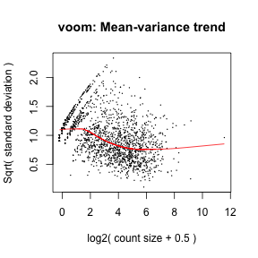

RNA sequencing, or [RNA-Seq](https://en.wikipedia.org/wiki/RNA-Seq), is quickly becoming the preferred method of global differential gene expression analysis, yet many biologists are unfamiliar with how to analyse RNA-Seq data.

I'm often asked by people starting out with RNA-Seq how they could begin to analyse their data. It's a tricky question because the methods vary substantially and the choices will depend on the experimental design, sequencing methodology and biological question(s) of interest.

However, there are several user-friendly R packages enable the those new to RNA-Seq analysis to easily get started with gene-level differential expression.

So to kick off, I'll show how you can go from raw data to results with 10 lines of code, then provide a brief breakdown the analysis step-by-step.

FASTQ files to differential expression results using 10 lines of R code
---

```r
buildindex(basename="chr1", reference="chr1.fa.gz")
align(index="chr1", readfile1=list.files(pattern=".fastq.gz$"))
fCounts <- featureCounts(files=list.files(pattern=".BAM$"), annot.inbuilt="hg19")
dge <- DGEList(counts=fCounts$counts, genes=fCounts$annotation)
thresholdCPM <- rowSums(cpm(dge) > 1) >= 2
dge <- dge[thresholdCPM, ]
design <- model.matrix(~c("A", "A", "B", "B"))
voomDat <- voom(dge, design)
fit <- eBayes(lmFit(voomDat, design))
topTable(fit, coef=2)
```

## Preliminaries

**Install R** If you don't have R installed already, check out the [R project](http://www.r-project.org).

**Downlaod and install the required bioconductor packages**

```r
source("http://bioconductor.org/biocLite.R")
biocLite(c("Rsubread", "limma", "edgeR"))
```

**Get some FASTQ files**
If you need some data in [FASTQ format](https://en.wikipedia.org/wiki/FASTQ_format) for testing purposes, you can download four files with 100,000 single-end reads hosted in [this github repo](https://github.com/SamBuckberry/Blog/tree/master/testFiles) using the code below (~30MB).

```r
download.file("https://cdn.rawgit.com/SamBuckberry/Blog/master/testFiles/testFiles.zip", destfile="testFiles.zip", method="curl")
unzip("testFiles.zip")
```
Make sure that the FASTQ files are in your working directory.

In this example, we will only align reads to human chromosome 1 (chr1), but aligning to the whole genome would be no different.

**Download a reference genome in FASTA format** 

To download the chromosome 1 reference sequence in FASTA format from UCSC:

```r
download.file("http://hgdownload.soe.ucsc.edu/goldenPath/hg19/chromosomes/chr1.fa.gz", destfile="chr1.fa.gz")
untar("chr1.fa.gz")
```


## Step-by-step breakdown of the differential expression analysis

First, load the required libraries:

```r
library(Rsubread)
library(edgeR)
library(limma)
```

### Step 1: Build a reference genome index

First, we need to create an index for the reference genome (This might take a couple of minutes).

```r
buildindex(basename="chr1", reference="chr1.fa")
```

### Step 2: Align reads to reference genome

Now, we align the RNA-Seq reads in the FASTQ files to the reference genome:

```r
align(index="chr1", readfile1=list.files(pattern=".fastq.gz$"))
```

### Step 3: Count the number of reads aligned to each gene

The next step is to count the number of reads that overlap genomic features of interest (eg. genes).

Here, we are using the inbuilt hg19 genes annotation. You have the option of providing other annotations in formats such as [GTF](https://en.wikipedia.org/wiki/Gene_transfer_format).

This step generates a table of read counts, with genes as rows and samples as colums:


```r
fCounts <- featureCounts(files=list.files(pattern=".BAM$"), annot.inbuilt="hg19")
```

Remove the file extensions from the sample names (Optional)

```r
colnames(fCounts$counts) <- substr(colnames(fCounts$counts), start=1, stop=2)
```


```r
head(fCounts$counts)
```

```
##           a1 a2 b1 b2
## 653635    78 79 65 61
## 100422834  0  0  0  0
## 645520     0  0  0  0
## 79501      0  0  0  0
## 729737    11  8  4  3
## 100507658  2  1  0  1
```

### Step 4: Filter and plot the data

We want to remove the genes not expressed, or expressed at low-levels before normalising and testing for differential expression.

First, we will create a ```DGEList``` object using edgeR  

```r
dge <- DGEList(counts=fCounts$counts)
```

To remove genes expressed at relatively low-levels, we (arbitrarily) limit the subset the data to include only the genes to which at least 1 read per million reads mapped (1 cpm) in at least 2 samples.

```r
thresholdCPM <- rowSums(cpm(dge) > 1) >= 2
dge <- dge[thresholdCPM, ]
```


It is also a very good idea plot the sample relations using a multi-dimensional scaling plot. Here, the ```plotMDS``` function shows the *distance* between samples in terms of the log2 fold-change. As expected, we can see that the distance between the "a" and "b" group samples is much greater than distance between the samples within each group (Note the different axis scales). For more details, type ```?plotMDS```

```r
plotMDS(dge)
```

 

### Step 5: Transform and normalise the data 

Now we can transform and normalise the data so we can test for differences between our groups. To do this we can use functions from the edgeR and Limma packages.

Here the ```voom``` function in the Limma package is used to transform the data. The resulting data set will have similar properties to normalised microarray data allowing the use of linear modelling.

You can also inspect at a couple of plots, one of the mean-variance trend generated by the ```voom``` function


```r
voomDat <- voom(dge, plot=TRUE)
```

 

and another MDS plot as above, after the voom normalisation-transformation step.

```r
plotMDS(voomDat)
```

 

### Step 6: Test for differential expression

First, we set up the design matrix. The "A" and "B" letters below correspond to the group for each samples.

```r
design <- model.matrix(~c("A", "A", "B", "B"))
```

Now we can fit the linear models and test for differential expression using the ```eBayes``` and ```lmFit``` functions in Limma.

```r
fit <- eBayes(lmFit(voomDat, design))
```

Look at the top 10 differentially expressed genes:

```r
topTable(fit, coef=2, n=10)
```

```
##            logFC   AveExpr         t      P.Value   adj.P.Val        B
## 6900    9.455124  7.890513  66.60225 1.834301e-06 0.001821007 4.941600
## 23208   5.616564 10.139017  46.46938 6.301567e-06 0.001821007 4.854583
## 26052   8.492326  7.409150  55.38321 3.452940e-06 0.001821007 4.493912
## 336    -8.173743  7.415885 -53.10933 3.986706e-06 0.001821007 4.451447
## 1063   -6.224667  8.026424 -42.71201 8.412690e-06 0.001821007 4.396636
## 23114   4.904982  9.419246  37.49921 1.313985e-05 0.001946317 4.348103
## 2563    8.259447  7.292882  45.92993 6.558870e-06 0.001821007 4.205470
## 388662  4.893855  9.189999  34.90678 1.679327e-05 0.002108754 4.149100
## 79727  -7.665938  7.162096 -45.44793 6.800354e-06 0.001821007 4.120870
## 11004  -5.613298  7.720785 -35.91942 1.522678e-05 0.002059129 3.962893
```

### Summary
It _can_ be relatively easy to move from raw data (FASTQ files) to differential expression statistics _at the gene level_. However, in this example, the default options have been used for most functions, and these might not be appropriate for your data set. All of the R packages used above have extensive and well-written documentation, and with some reading, you should be able to achieve much more sophisticated analyses.

### Notes and references

This example was adapted from, and is similar to the case study that can be found at http://bioinf.wehi.edu.au/RNAseqCaseStudy/

**Rsubread** http://www.bioconductor.org/packages/release/bioc/html/Rsubread.html

**edgeR** http://www.bioconductor.org/packages/release/bioc/html/edgeR.html

**limma** http://www.bioconductor.org/packages/release/bioc/html/limma.html

The analysis methods used here were also used in the [comprehensive assessment of RNA-seq accuracy, reproducibility and information content by the Sequencing Quality Control Consortium](http://www.nature.com/nbt/journal/v32/n9/full/nbt.2957.html)

### R session info

The platform and package versions I used to develop this example. 

```r
sessionInfo()
```

```
## R version 3.1.1 (2014-07-10)
## Platform: x86_64-apple-darwin13.1.0 (64-bit)
## 
## locale:
## [1] en_AU.UTF-8/en_AU.UTF-8/en_AU.UTF-8/C/en_AU.UTF-8/en_AU.UTF-8
## 
## attached base packages:
## [1] stats     graphics  grDevices utils     datasets  methods   base     
## 
## other attached packages:
## [1] edgeR_3.8.4     limma_3.22.1    Rsubread_1.16.1 knitr_1.8      
## 
## loaded via a namespace (and not attached):
## [1] codetools_0.2-9 digest_0.6.4    evaluate_0.5.5  formatR_1.0    
## [5] stringr_0.6.2   tools_3.1.1
```


